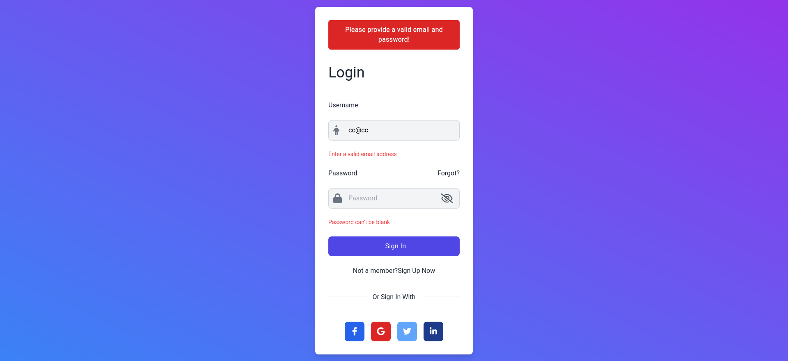
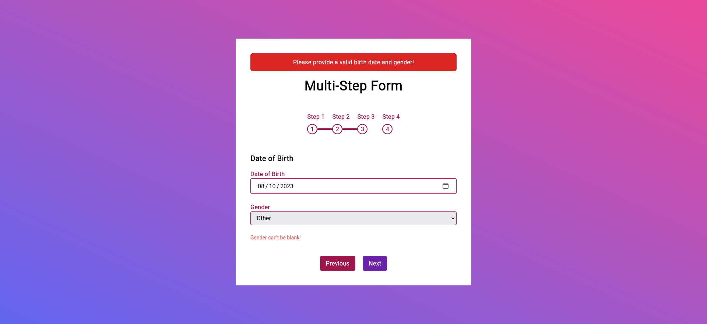

# 📚 Input RS Yew Tailwind Components

## 🛠️ Pre-requisites:

### 🐧 **Linux Users**

1. **Install [`rustup`](https://www.rust-lang.org/tools/install)**:

   ```sh
   curl --proto '=https' --tlsv1.2 -sSf https://sh.rustup.rs | sh
   ```

1. **Install [`trunk`](https://trunkrs.dev/)**:

   ```sh
   cargo install --locked trunk
   ```

1. **Add the Wasm target**:

   ```sh
   rustup target add wasm32-unknown-unknown
   ```

### 🪟 **Windows Users**

1. **Download and install `rustup`**: Follow the installation instructions [here](https://www.rust-lang.org/tools/install).

1. **Install [Windows Subsystem for Linux (WSL)](https://learn.microsoft.com/en-us/windows/wsl/install)**: Open PowerShell as administrator and run:

   ```sh
   wsl --install
   ```

1. **Reset Network Stack**: In PowerShell (administrator mode), run:

   ```sh
   netsh int ip reset all
   netsh winsock reset
   ```

1. **Install Linux packages in WSL**: Once inside your WSL terminal, update and install required dependencies:

   ```sh
   sudo apt update
   sudo apt install build-essential pkg-config libudev-dev
   ```

1. **Install `trunk`**:

   ```sh
   cargo install --locked trunk
   ```

1. **Add the Wasm target**:

   ```sh
   rustup target add wasm32-unknown-unknown
   ```

## 🚀 Building and Running

1. Fork/Clone the GitHub repository.

   ```bash
   git clone https://github.com/opensass/input-rs
   ```

1. Navigate to the application directory.

   ```bash
   cd input-rs/examples/yew
   ```

1. Run the client:

   ```sh
   trunk serve --port 3000
   ```

Navigate to http://localhost:3000 to explore all available components.

## 🌀 Tailwind CSS Components

This section lists components implemented using the [Tailwind CSS](https://tailwindcss.com/) framework.

### 🔐 Login Forms

| ID | Preview | Demo | Localhost |
|---|---|---|---|
| 1 |  | [](https://tailwind-login-form-1.netlify.app/) | [Localhost](http://localhost:3000/login/1) |
| 2 |  | [](https://tailwind-login-form-2.netlify.app/) | [Localhost](http://localhost:3000/login/2) |
| 3 |  | [](https://tailwind-login-form-3.netlify.app/) | [Localhost](http://localhost:3000/login/3) |

### 📬 Contact Forms

| ID | Preview | Demo | Localhost |
|---|---|---|---|
| 1 |  | [](https://tailwind-contact-form-1.netlify.app/) | [Localhost](http://localhost:3000/contact/1) |

### 🔢 Multi-Steps Forms

| ID | Preview | Demo | Localhost |
|---|---|---|---|
| 1 |  | [](https://tailwind-multi-step-form-1.netlify.app/) | [Localhost](http://localhost:3000/multi-step/1) |
